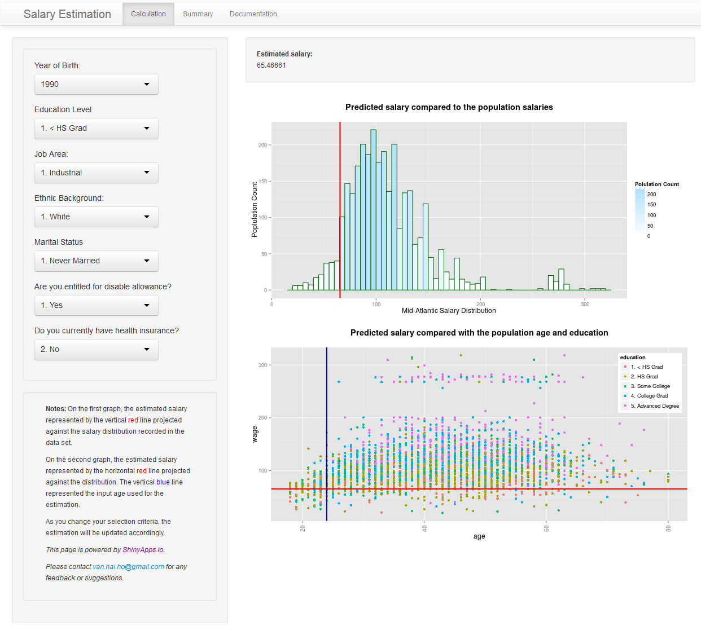

## What is in SEA for me?

<ul>
<li> Everyone wants to know what you earn is in reasonable range </li>
<li> No one wants to get pay less than what you are entitled to </li>
<li> How to find out the market range? </li>
<li> What factors that might influence my remuneration? </li>
</ul>

=> SEA provides you a facility to quickly find out your worths in the market, and
 
=> enables you to easily manipulate and explore different options.

--- .class #id 

## What does SEA do? - On Server side

- SEA uses <code>Wage</code> data set from <code>ISLR</code> package for training.
- The data set contains 3000 observations with 12 variables.
- Excluded variables that are not helpful for the model:
  + `sex`, `region`: contains of single value, resulting in constance variance
  + `logwage`: calculated value for the recorded wages in the data set.
- SEA uses Linear Regression model to analyse the common variables collected in <code>Wage</code> data set in order to estimate salary level:
  
  + <i>Year of Birth</i>, 
  + <i>Education Level</i>, 
  + <i>Job Area</i>, 
  + <i>Ethnic Background</i>, 
  + <i>Marital Status</i>, and 
  + <i>Health</i>.

---

## What does SEA do? (cont.)

- User Interfaces: 

  + [Shiny](http://shiny.rstudio.com/) is used to build SEA to enable instantly reactivity with user interactions on the application.
  
- SEA is hosted on [ShinyApps.io](http://www.shinyapps.io).
- Documentations are also available with the links on the applications.

---

## SEA in Action

Access SEA: <http://vanhaiho.shinyapps.io/ddp_shiny_project/>

    

