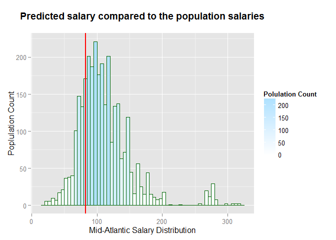
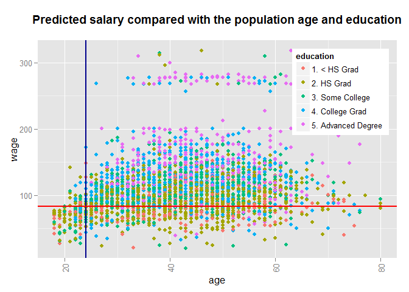

# Getting Started with Salary Estimation Application (SEA)
Van Hai Ho  
August 22, 2014  

# Introduction

Everyone wants to know what we earn is in reasonable range in the industry, especially for job seekers, knowing the market and know your worths can give you great power to negotiate for jobs offered to you. We do not want to be paid less than what you are entitled to. Salary Estimation Application (SEA) provides you a facility to quickly find out your worths in the market and enable you to manipulate and explore different options. 

This document provides step-by-step instruction on how to use Salary Estimation Application and gives explanation for result.

# User Guides

## Access SEA

SEA is accessible from the following link: <http://vanhaiho.shinyapps.io/ddp_shiny_project/>. This link works best on Firefox and Chrome browsers. 

## SEA Overview 

SEA uses <code>Wage</code> data set from <code>ISLR</code> package. There are many factors that might influence your remuneration package. Seven features selected in <code>Wage</code> data set are the common ones that would affect the level of your salary.

- **Year of Birth**: Your age can be one of the factors to indicate your experience for the job, thus it can help to provide a projection for salary.
- **Education Level**: Majority of job advertisements are asking for some form of qualifications. Depends on your qualifications, you will be offered salary level accordingly.
- **Job Area**: At the moment, SEA only provides 2 job areas: *Industrial* and *Information*. More job categories can be added at a later time.
- **Ethnic Background**: We are trying to eliminiate discrimination over race. However, in reality, this is still one of the factors that might influence our salary level.
- **Marital Status**: Some jobs require some activities that might not well suited for a married person with small children, for example. Thus, it will limit the options in renumeration package.
- **Health**: This is an important factor in getting job and getting well paid job.

By analysing these features, SEA builds up the model for estimating salary level for a candidate.

When SEA first loads into a browser, it will load and display default input criteria for prediction, as shown in the screenshot below.

 

When you select an appropriate feature for your case, SEA will update the estimated salary accordingly and project it onto the distribution of the population data used to build the model. The next section will provide detailed explanation of the predicted result.

## Exploration with SEA & Result Intepretation

When you select the features for your case, for instance, change the <code>Year of Birth</code> to <code>1975</code>, and <code>Education Level</code> to <code>College Grad</code>, you will notice that as soon as you finish changing a value, the <code>Estimated salary</code> will be updated on the screen, and the red line and blue line are moving according to the newly estimated salary and the selected <code>Year of Birth</code>.

On the first graph, the estimated salary represented by the vertical red line projected against the salary distribution recorded in the data set.

 

On the second graph, the estimated salary represented by the horizontal red line projected against the distribution. The vertical blue line represented the input age used for the estimation.

 

For more information about this work, and for any feedback or suggestions, please contact <van.hai.ho@gmail.com>.

# References

This works has been developed with R, RStudio, Shiny, and the application is hosted on [ShinyApps.io](http://www.shinyapps.io).

